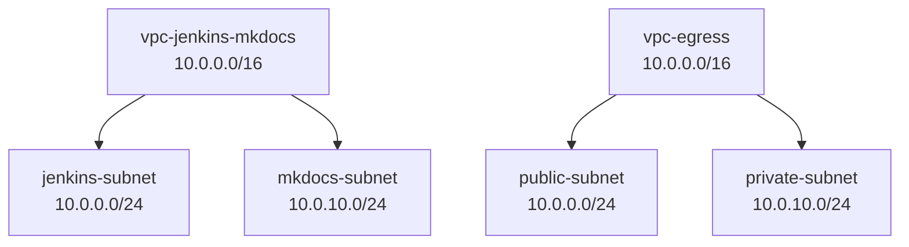
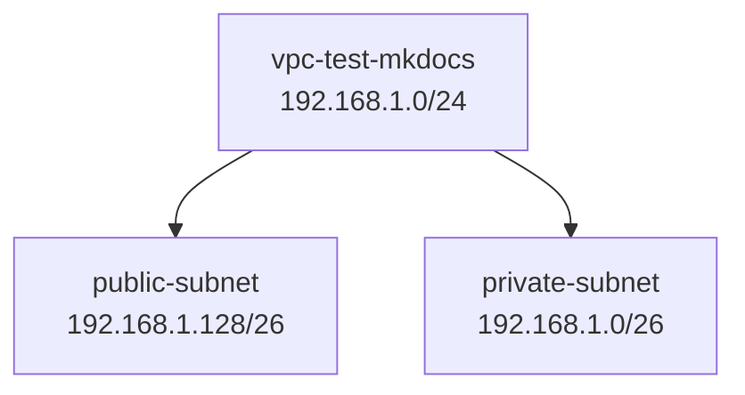

# AWS VPC Configuration

!!! info "Last Updated"
    **2024-12-07 19:56:05**

## Project: Argenta

!!! abstract "Infrastructure Overview"
    Network architecture for Argenta project
        
### Environment: argenta-uat

!!! example "Network Details"

#### VPC: vpc-jenkins-mkdocs (us-east-1)

!!! info "VPC Details"
    - **VPC ID**: `vpc-031a6a00f434aa02e`
    - **CIDR Block**: `10.0.0.0/16`

##### Subnets

| Name | CIDR | Availability Zone |
|:-----|:-----|:-----------------|
| `jenkins-subnet` | `10.0.0.0/24` | `us-east-1a` |
| `mkdocs-subnet` | `10.0.10.0/24` | `us-east-1a` |

#### VPC: vpc-egress (us-east-1)

!!! info "VPC Details"
    - **VPC ID**: `vpc-0ec56b86ad52653d7`
    - **CIDR Block**: `10.0.0.0/16`

##### Subnets

| Name | CIDR | Availability Zone |
|:-----|:-----|:-----------------|
| `public-subnet` | `10.0.0.0/24` | `us-east-1a` |
| `private-subnet` | `10.0.10.0/24` | `us-east-1a` |

### Environment: argenta-sdb

!!! example "Network Details"

#### VPC: vpc-test-mkdocs (us-east-2)

!!! info "VPC Details"
    - **VPC ID**: `vpc-082133d80ba60284a`
    - **CIDR Block**: `192.168.1.0/24`

##### Subnets

| Name | CIDR | Availability Zone |
|:-----|:-----|:-----------------|
| `public-subnet` | `192.168.1.128/26` | `us-east-2a` |
| `private-subnet` | `192.168.1.0/26` | `us-east-2a` |

